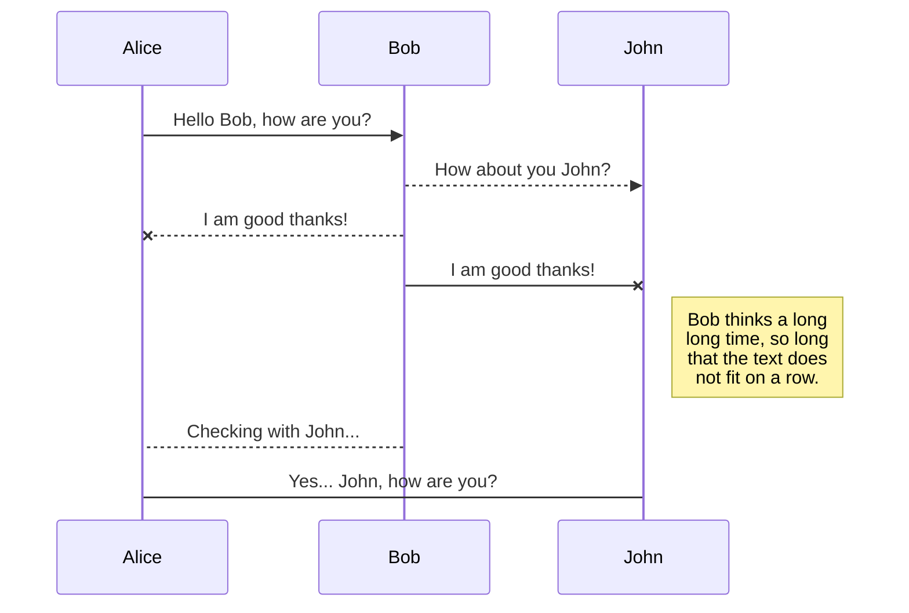
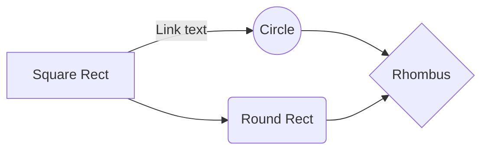

# SC2002 SCSC Group 1 CAMs

This is the repository for SC2002 SCSC Group 1's project. 

# Data Files

The CAMs application requires (currently), 4 files

## student_list.csv

Display name, NTU email (ID), Faculty, Hashed Password

## staff_list.csv

Identical as above. TODO: Figure out if it is worth having two separate files

## camps.csv

camp_id, campName, faculty , startDate (yyyyMMdd), endDate, regEnd, location, description, maxSize, maxComm, inCharge, visible

## UML diagrams

You can render UML diagrams using [Mermaid](https://mermaidjs.github.io/). For example, this will produce a sequence diagram:

And this will produce a flow chart:

